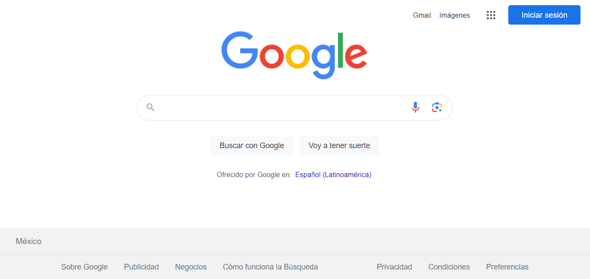

# Clon de google
Proyecto creado en **TecnolochicasPro simulando en la pagina principal navegador de Google**
Poniendo en practica lo aprenido en el bootcamp logre realizar un clon de explorador de google.
## 1.Intro 
El proyecto fue creado con **HTML Y CSS**. Se trata de el navegador mas usado:la interfaz Google
*Puede visitar el sitio de el siguiente enlace

**Inspirate de la realizacion de este proyecto,utiliza  tu destreza para demostrar que tu futuro es ser desarolladora frontend ☺️**

##Contenido del proyecto 
1. Header
Seccion muestra  el menu y foto de perfil 
2. Main 
Contiene los elementos centrales en el buscador
3. Footer
Incluye hipervincuos al final de la pagina

Realizado por Natasha Velazquez 💜 💻 
